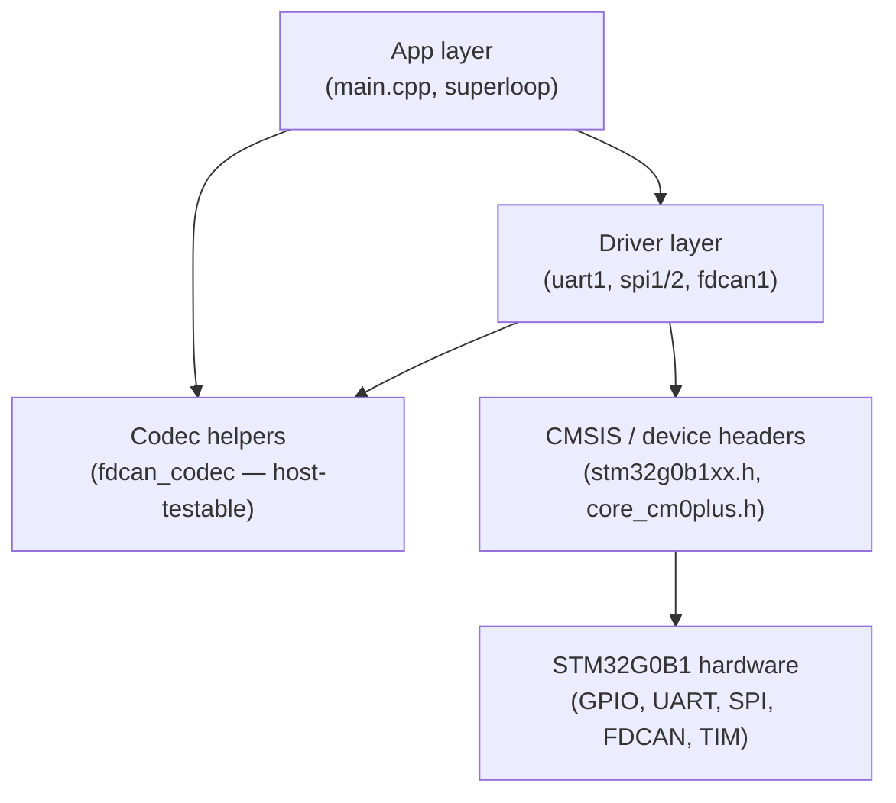
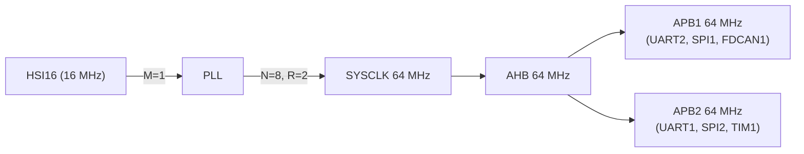

# Architecture

This project is intentionally split into clear layers.

## Layering Rules

- App layer orchestrates system behavior and sequencing.
- Driver layer owns direct register/peripheral access.
- App can call Driver APIs.
- Driver must not depend on App symbols.
- Tests should target pure logic and helper modules when possible.

## Layer Overview



Codec helpers (`fdcan_codec.c/h`) depend only on `<stdint.h>` and are fully testable on a host build without MCU headers.

## Folder Responsibilities

- App/Inc, App/Src
  - Application entry and superloop behavior.
  - High-level startup sequence and orchestration.

- Driver/Inc, Driver/Src
  - Peripheral drivers (UART, SPI, FDCAN).
  - Platform/system code (startup, system clock, syscalls).

- tests
  - Host-side tests runnable without target hardware.

- thirdparty
  - Vendor/CMSIS code treated as read-only input.

## Directory Structure

```
stm32g071-pilot/
├── App/
│   ├── Inc/main.h          # Pin and clock constants
│   └── Src/main.cpp        # Entry point, superloop, peripheral init
├── Driver/
│   ├── Inc/
│   │   ├── fdcan_codec.h   # FDCAN_Message_t + pack/unpack API
│   │   ├── fdcan1.h        # FDCAN1 public driver API
│   │   ├── spi1.h / spi2.h
│   │   ├── uart1.h / uart2.h
│   │   └── systick.h
│   └── Src/
│       ├── fdcan_codec.c   # DLC helpers, TX/RX element codec
│       ├── fdcan1.c        # FDCAN1 init, TX, RX ISR
│       ├── spi1.c / spi2.c
│       ├── uart1.c / uart2.c
│       ├── syscalls.c      # Newlib stubs (_write → UART2)
│       ├── startup_stm32g071xx.s
│       └── system_stm32g0xx.c  # SystemClock_Config (HSI16 → PLL → 64 MHz)
├── tests/
│   ├── CMakeLists.txt      # Host CTest build (native GCC)
│   └── fdcan_codec_tests.c
├── thirdparty/CMSIS/       # ARM CMSIS + ST device headers
├── cmake/
│   └── toolchain-arm-none-eabi.cmake
├── ld/STM32G0B1RETx_FLASH.ld
├── openocd/stm32g0b1.cfg
└── CMakeLists.txt          # Cross-compile firmware build
```

## Dependency Direction

Allowed:
- App -> Driver
- App -> thirdparty (indirectly via Driver headers where needed)
- Driver -> thirdparty
- tests -> Driver helper modules

Avoid:
- Driver -> App
- tests -> hardware-only side effects

## Build Targets

| Target | Command | Description |
|--------|---------|-------------|
| Firmware (ELF/HEX/BIN) | `cmake --build build` | Cross-compiled for Cortex-M0+ |
| Host tests | `cmake --build build-host-tests && ctest --test-dir build-host-tests` | Native GCC, no MCU |

## Clock Tree



## Interrupt Priority Map

| IRQ | Handler | Source |
|-----|---------|--------|
| USART1_IRQn | USART1_IRQHandler | UART1 RX byte |
| USART2_IRQn | USART2_IRQHandler | UART2 RX byte |
| SPI1_IRQn | SPI1_IRQHandler | SPI1 TX/RX |
| DMA1_Channel1_IRQn | DMA1_Channel1_IRQHandler | SPI2 DMA complete |
| FDCAN1_IT0_IRQn | FDCAN1_IT0_IRQHandler | FDCAN1 RX FIFO 0 new message |

All interrupts use default NVIC priority (0).

## Suggested Evolution

1. Keep register-touching code minimal and concentrated in Driver.
2. Move parsers/packers/validation logic into testable helper modules.
3. Use narrow headers in Driver/Inc to keep interfaces stable.
4. Expand tests around helper modules before hardware integration.
