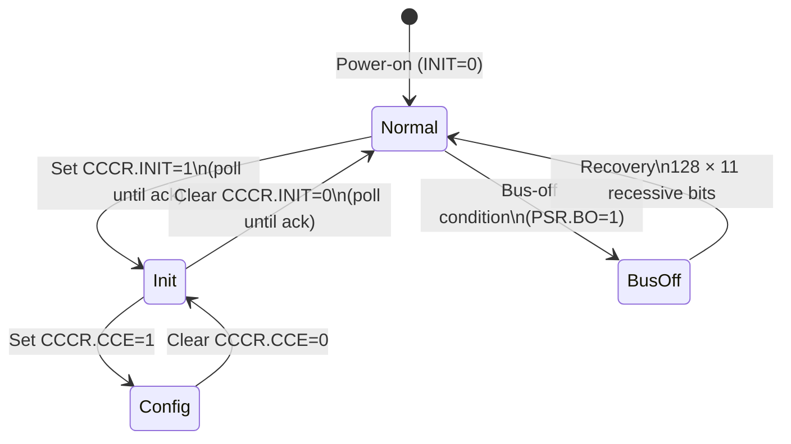
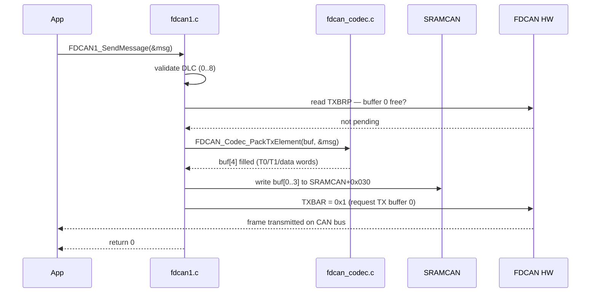
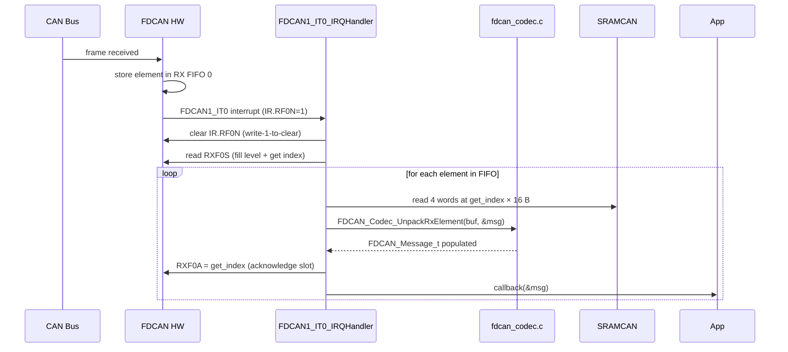

# FDCAN

## Current State

- FDCAN1 init, TX path, and RX FIFO extraction are complete.
- TX packs a frame into SRAMCAN via `FDCAN_Codec_PackTxElement` then sets `TXBAR`.
- RX drains FIFO 0 in the ISR via `FDCAN_Codec_UnpackRxElement` then calls the registered callback.
- Pack/unpack helpers are tested on host with CTest.
- FDCAN2 is not yet implemented.

## Data Model

```c
typedef struct {
    uint32_t id;       /* 11-bit (std) or 29-bit (ext) CAN ID */
    uint8_t  dlc;      /* Data length code 0..8               */
    uint8_t  data[8];  /* Payload bytes                       */
    uint32_t flags;    /* Bit 0: XTD (extended ID), Bit 1: RTR */
} FDCAN_Message_t;
```

Defined in `Driver/Inc/fdcan_codec.h` so it remains testable on the host without MCU headers.

## Message RAM Layout

Configured via RXGFC (F0S=3, no filters, accept-all via ANFS/ANFE=01) and TXBC (NDTB=1):

```
SRAMCAN_BASE = 0x4000AC00
├── +0x000  RX FIFO 0 element 0   (16 B: R0 R1 D0–3 D4–7)
├── +0x010  RX FIFO 0 element 1
├── +0x020  RX FIFO 0 element 2
└── +0x030  TX buffer 0           (16 B: T0 T1 D0–3 D4–7)
```

Word layout for a classic CAN frame (8-byte payload):

| Word | TX field | RX field |
|------|----------|----------|
| 0 | \[28:18\] STDID, \[29\] XTD, \[30\] RTR | \[28:18\] STDID, \[29\] XTD, \[30\] RTR |
| 1 | \[3:0\] DLC, \[20\] FDF=0 | \[3:0\] DLC |
| 2 | bytes 0–3 (little-endian) | bytes 0–3 |
| 3 | bytes 4–7 | bytes 4–7 |

## CCCR State Machine



## TX Sequence



## RX Sequence



## Bitrate Calculation

500 kbps at 64 MHz FDCAN clock:

| Parameter | Value | Notes |
|-----------|-------|-------|
| NBRP | 7 | Prescaler = 8 → tq = 125 ns |
| NTSEG1 | 11 | 12 tq = 1500 ns (propagation + phase seg 1) |
| NTSEG2 | 3 | 4 tq = 500 ns (phase seg 2) |
| NSJW | 3 | 4 tq sync jump width |
| **Bit time** | **16 tq** | **2000 ns = 500 kbps** |

## Test Strategy

Host-testable (no hardware needed):

| Test | What it checks |
|------|---------------|
| `test_dlc_to_length` | DLC 0–15 → byte count |
| `test_length_to_dlc` | byte count → smallest valid DLC |
| `test_classic_validation` | DLC/length ≤ 8 acceptance |
| `test_pack_standard_id` | T0 ID placement, T1 DLC, T2 data bytes |
| `test_pack_rtr_flag` | T0 RTR bit set |
| `test_unpack_standard_id` | R0 ID extraction, data bytes |
| `test_pack_unpack_roundtrip` | TX pack → RX unpack, full field fidelity |

Hardware-only (board + another CAN node required):

- Init sequence completes without bus-off (PSR.BO=0)
- TX frame visible on oscilloscope at 500 kbps
- RX callback fires with correct ID/DLC/payload

## Open Items

- FDCAN2 driver (same architecture, pins PD12/PD13, AF3)
- CAN message filtering (RXGFC LSS/LSE + filter list)
- CAN FD mode (CCCR.FDOE, CCCR.BRSE, data phase bitrate)
- TX event FIFO for transmission timestamps
- SVD file for peripheral register inspection in Cortex-Debug
